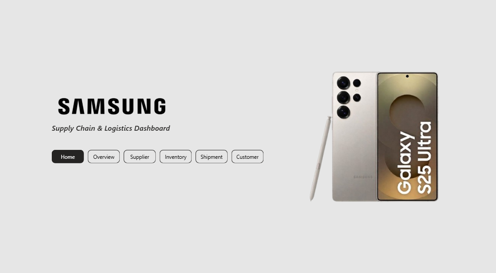
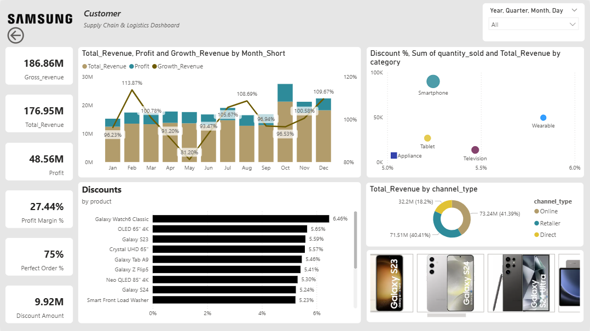

[README.md](https://github.com/user-attachments/files/31197948/README.md)
<div align="center">

# 📱 Supply Chain & Logistics Dashboard

### End-to-End Power BI Analytics — From Raw Materials to the Customer's Door


</div>

---

## 📑 Table of Contents

- [Overview](#-overview)
- [Dashboard Preview](#️-dashboard-preview)
- [Report Pages in Detail](#-report-pages-in-detail)
- [Data Model](#️-data-model)
- [Key Measures](#-key-measures)
- [Tools & Techniques](#️-tools--techniques)
- [Project Structure](#-project-structure)
- [How to Use](#-how-to-use)
- [Contact Me](#-contact-me)

---

## 📌 Overview

This project is a full **supply chain and logistics intelligence dashboard** built in **Power BI** for a Samsung Electronics business scenario. It follows a product's entire journey — **supplier → production → inventory → shipment → sale** — and turns two years of operational data (2023–2024) into a connected, interactive story across **six report pages**.

The model sits on a proper **star schema**: 5 dimension tables and 5 fact tables totaling **over 24,000 transactional rows**, so every KPI on every page slices cleanly by product, facility, supplier, customer, and date — with a dedicated `MeasuresTable` holding the DAX logic, so nothing is duplicated across pages.

---

## 🖼️ Dashboard Preview

<div align="center">

### 🏠 Home Page
Brand landing page with navigation into every section of the report.



<br/><br/>

### 👥 Customer Page
Revenue, profit, and discount performance by channel and category.



</div>

**Highlights from the Customer page:**

| Metric | Value |
|---|---|
| Gross Revenue | **186.86M** |
| Total Revenue | **176.95M** |
| Profit | **48.56M** |
| Profit Margin | **27.44%** |
| Perfect Order % | **75%** |
| Discount Amount | **9.92M** |

---

## 🧭 Report Pages in Detail

### 🏠 Home
Brand identity and a page navigator that links out to all five analytical pages.

### 📊 Overview
The command-center page — **10 KPI cards** (Gross Revenue, Total Revenue, Profit, Profit Margin %, Perfect Order %, Shipment, Order Quantity, Inventory Quantity, Shipment Quantity, Total Delivered Quantity), backed by:
- **Supplier by Avg Time** — average lead time per supplier
- **Inventory Stock** — inventory value per product
- **Delay by carrier** — total delayed shipments per carrier
- **Total Revenue** — revenue per top customer
- 4 donut charts pairing volume against risk: *Order Qty vs. Defect Rate*, *Inventory Qty vs. Safety Stock*, *Shipments vs. Delays*, *Delivered Qty vs. Delayed Qty*

### 🏭 Supplier
**6 KPI cards** — Total Unit Cost, Order Quantity, Avg. Lead Time, Avg. Quality Score, Avg. Unit Cost, and Supplier Count — supported by:
- **Order Volume by Speciality** — ordered quantity and total spend by supplier specialty and tier
- **Supplier Performance** — quality score vs. lead time per supplier
- **Spend by Country** — procurement spend by supplier country
- **Unit Cost trend by month**, plus a supplier slicer for drill-down

### 📦 Inventory
**6 KPI cards** — Inventory Value, Safety Stock, Turnover Rate, Days of Inventory, Defective Units, and Avg. Defective Units — supported by:
- **Defect Rate** — defect rate and average lead time per product
- **Current Stock, Safety Stock & Reorder Point** — combo chart per product
- **Defective units trend** and **inventory value trend**, both by month

### 🚚 Shipment
**6 KPI cards** — Total Shipments, Shipment Cost, Total Delays, Total Shipment Quantity, Total Delivered Shipments, and Delivered % — supported by:
- **Total Delay Shipments** and **Delivered vs. Delayed** — both broken down across all **9 carriers** (Maersk Line, DHL Express, FedEx International, UPS Worldwide, CMA CGM, Kuehne+Nagel, DB Schenker, XPO Logistics, C.H. Robinson)
- **Shipment Cost trend** by month
- **Total Delay by delay reason** — across all 8 tracked causes (Port Congestion, Customs Clearance, Weather Disruption, Carrier Capacity, Mechanical Failure, Documentation Issue, Security Check, Address Exception)
- A status donut (**Delivered / In Transit / Delayed / Processing**) plus a carrier slicer

### 👥 Customer
**6 KPI cards** — Gross Revenue, Total Revenue, Profit, Profit Margin %, Perfect Order %, and Discount Amount — supported by:
- **Revenue by channel_type** donut (Online / Retailer / Direct)
- **Profit, Total Revenue & Growth Revenue by month** — combo chart
- **Discount % vs. quantity sold vs. revenue by category** — scatter chart
- **Discounts by product** — top discounted SKUs, plus a customer slicer

---

## 🗃️ Data Model

Built as a star schema for fast, accurate cross-filtering across every page.

**Dimension tables**
| Table | Rows | Description |
|---|---|---|
| `dim_product` | 16 | SKUs across Smartphones (Galaxy S & Z series), Tablets (Tab S & A), Televisions (Neo QLED, OLED, Crystal UHD), Appliances, and Wearables — with price, cost, weight, and image |
| `dim_customer` | 5 | Key accounts: Amazon.com, Best Buy, MediaMarkt Saturn, Flipkart, Samsung Direct Store — with channel type and annual volume |
| `dim_supplier` | 7 | Samsung Electronics, SK Hynix, TSMC, Sony Semiconductor, BOE Technology, and regional assembly partners — tiered as Tier 1 / Tier 2 with quality scores |
| `dim_facility` | 6 | Manufacturing plants (South Korea, Vietnam) and distribution warehouses (USA, Poland, India) with type, specialization, and capacity |
| `dim_date` | 731 | Full calendar table spanning **2023-01-01 to 2024-12-31**, with year, quarter, month, week, and weekend flags |

**Fact tables**
| Table | Rows | Description |
|---|---|---|
| `fact_procurement` | 2,200 | Purchase orders — quantity, unit cost, lead time, and delivered quality score |
| `fact_production` | 4,500 | Units produced per batch, defective units, and defect rate |
| `fact_inventory` | 1,152 | Stock level vs. safety stock level and reorder point, by product and facility |
| `fact_shipment` | 7,500 | Shipments by carrier, status, delay reason, shipping cost, and weight |
| `fact_sales` | 8,500 | Orders — quantity, discount, gross/net revenue, cost, profit, and profit margin |

---

## 📐 Key Measures

The model includes a dedicated `MeasuresTable`, plus native DAX measures on the fact tables, powering the cards and charts above:

- **Revenue & Profit:** `Gross_revenue`, `Total_Revenue`, `Profit`, `Profit Margin %`, `Growth_Revenue`, `Discount Amount`
- **Procurement:** `Total_Unit_Cost`, `AVG_Unit_Cost`, `Order_QTY`, `AVG_Lead_Time`, `AVG Quality Score`
- **Inventory:** `Inventory_Value`, `Safety_Stock`, `Turnover Rate`, `Days of Inventory`, `Defective Units`, `Defect_Rate`
- **Shipment:** `Total_Shipment`, `Shipment_Cost`, `Total_Delay`, `Total_Delivered_Ship`, `Delivered %`
- **Fulfillment:** `Perfect Order %` — the single metric tying inventory, production, and shipment quality together

---

## 🛠️ Tools & Techniques

- **Power BI Desktop** — data modeling, DAX measures, and report design
- **Star Schema Modeling** — 5 dimensions × 5 facts, connected on surrogate keys, with a centralized `MeasuresTable`
- **DAX Measures** — revenue, profit margin, discount %, defect rate, perfect order %, turnover rate, and month-over-month growth
- **Power Query** — data shaping and relationship building from raw CSV extracts
- **Interactive Slicers & Cross-Filtering** — supplier, carrier, and customer slicers drive every visual on their page

---

## 📁 Project Structure

```
Samsung_Dashboard/
├── README.md
├── Samsung_Dashboard.pbix
├── dim_customer.csv
├── dim_date.csv
├── dim_facility.csv
├── dim_product.csv
├── dim_supplier.csv
├── fact_inventory.csv
├── fact_procurement.csv
├── fact_production.csv
├── fact_sales.csv
├── fact_shipment.csv
└── assets/
    ├── dashboard-home.png
    └── dashboard-customer.png
```

---

## 🚀 How to Use

1. Download `Samsung_Dashboard.pbix` and all `dim_*.csv` / `fact_*.csv` files from this repository.
2. Open `Samsung_Dashboard.pbix` in **Power BI Desktop**.
3. If prompted, repoint the data source to the folder containing the CSV files on your machine.
4. Explore all six pages via the navigation bar on the Home page.

---

## 📬 Contact Me

<div align="center">

[](mailto:salemomar676@gmail.com)
[](https://gamma.app/docs/Copy-of-Brand-Partnership-Proposal-lrp9yrhau9gdpj1)
[](https://www.linkedin.com/in/eng-omarsalem)

</div>

---

<div align="center">

Made with 📱 and Power BI

</div>
